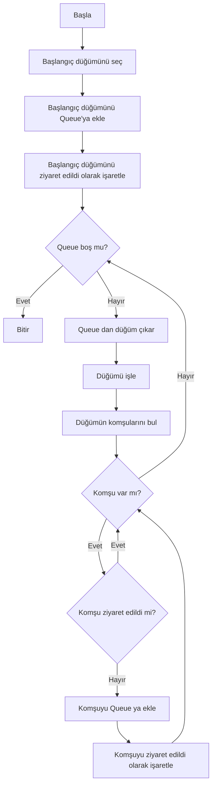
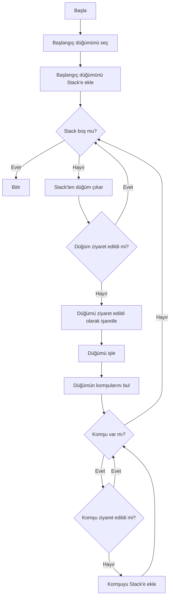

# Graf Algoritmaları ve Sosyal Ağ Analizi Uygulaması

## 1. Proje Bilgileri

**Proje Adı:** Graf Algoritmaları ve Sosyal Ağ Analizi Uygulaması

**Ekip Üyeleri:** [Talha Fırat Meşe - Uğuralp Kıvanç]

**Tarih:** Aralık 2025

**Dil:** C# (.NET 10.0 Windows Forms)

**IDE:** Visual Studio

---

### 2.1 Problemin Tanımı

Sosyal ağlar, iletişim sistemleri gibi sosyal medyadan da aşina olacağımız yapıları modellemek için graf veri yapıları kullanılır. Bu projede, graf üzerinde çeşitli algoritmaların görselleştirilmesi, çalıştırılması ve analiz edilmesi amaçlanmıştır.

### 2.2 Projenin Amacı

Bu proje, aşağıdaki amaçları gerçekleştirmek için geliştirilmiştir:

- Graf veri yapısını görsel olarak oluşturma ve düzenleme
- Pathfinding(Yol Bulma) algoritmalarını (BFS, DFS, Dijkstra, A*) görselleştirme
- Graf analiz algoritmalarını (Degree Centrality(Merkezilik), Connected Components(Bağlı Bileşenler), Welsh-Powell Renklendirme) uygulama
- Algoritmaların performansını ölçme ve karşılaştırma
- Nesne yönelimli programlama(OOP) prensiplerini (Interface, Abstract Class) uygulama
- Graf verilerini CSV ve Komşuluk Matrisi formatında kaydetme ve yükleme

### 2.3 Kullanım Alanları

- Sosyal ağ analizi
- En kısa yol problemleri
- Graf renklendirme problemleri
- İlişki ağları görselleştirme

---

## 3. Algoritmalar

### 3.1 Breadth-First Search (BFS)

#### 3.1.1 Çalışma Mantığı

BFS, graf üzerinde genişlik öncelikli arama yapan bir algoritmadır. FIFO (First In First Out) prensibine göre çalışır ve Queue (kuyruk) veri yapısı kullanır.

**Algoritma Adımları:**
1. Başlangıç düğümü kuyruğa eklenir ve ziyaret edildi olarak işaretlenir
2. Kuyruktan bir düğüm çıkarılır.
3. Bu düğümün tüm komşuları kontrol edilir
4. Ziyaret edilmemiş komşular kuyruğa eklenir
5. Adım 2 ye dönülür, kuyruk boşalana kadar devam edilir

#### 3.1.2 Akış Diyagramı

#### 3.1.3 Karmaşıklık Analizi

- **Zaman Karmaşıklığı:** O(V + E)
  - V: Düğüm sayısı (Vertex)
  - E: Kenar sayısı (Edge)
  - Her düğüm bir kez ziyaret edilir, her kenar bir kez kontrol edilir

- **Uzay Karmaşıklığı:** O(V)
  - Queue'da en fazla V düğüm bulunabilir
  - Ziyaret edilen düğümler için O(V) bellek

#### 3.1.4 Literatür İncelemesi

BFS algoritması ilk olarak 1959 yılında Edward F. Moore tarafından labirent çözme problemi için önerilmiştir. Daha sonra C.Y. Lee tarafından 1961'de bağlantı yolları bulma problemi için uygulanmıştır. BFS, en kısa yol problemi için ağırlıksız graflarda optimal çözüm sağlar.

**Kaynak:** Moore, E. F. (1959). "The shortest path through a maze". Proceedings of the International Symposium on the Theory of Switching.

---

### 3.2 Depth-First Search (DFS)

#### 3.2.1 Çalışma Mantığı

DFS, graf üzerinde derinlik öncelikli arama yapan bir algoritmadır. LIFO (Last In First Out) prensibine göre çalışır ve Stack (yığın) veri yapısı kullanır.

**Algoritma Adımları:**
1. Başlangıç düğümü stack'e eklenir
2. Stack'ten bir düğüm çıkarılır
3. Eğer düğüm ziyaret edilmemişse, ziyaret edildi olarak işaretlenir
4. Bu düğümün ziyaret edilmemiş komşuları stack'e eklenir
5. Adım 2'ye dönülür, stack boşalana kadar devam edilir

#### 3.2.2 Akış Diyagramı

