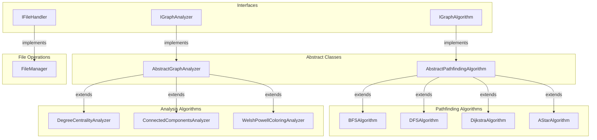

# Graf Algoritmaları ve Sosyal Ağ Analizi Uygulaması

## 1. Proje Bilgileri

**Proje Adı:** Graf Algoritmaları ve Sosyal Ağ Analizi Uygulaması

**Ekip Üyeleri:** [Talha Fırat Meşe - Uğuralp Kıvanç]

**Tarih:** Aralık 2025

**Dil:** C# (.NET 10.0 Windows Forms)

**IDE:** Visual Studio

---


### 2.1 Problemin Tanımı

Sosyal ağlar, iletişim sistemleri gibi sosyal medyadan da aşina olacağımız yapıları modellemek için graf veri yapıları kullanılır. Bu projede, graf üzerinde çeşitli algoritmaların görselleştirilmesi, çalıştırılması ve analiz edilmesi amaçlanmıştır.

### 2.2 Projenin Amacı

Bu proje, aşağıdaki amaçları gerçekleştirmek için geliştirilmiştir:

- Graf veri yapısını görsel olarak oluşturma ve düzenleme
- Pathfinding(Yol Bulma) algoritmalarını (BFS, DFS, Dijkstra, A*) görselleştirme
- Graf analiz algoritmalarını (Degree Centrality(Merkezilik), Connected Components(Bağlı Bileşenler), Welsh-Powell Renklendirme) uygulama
- Algoritmaların performansını ölçme ve karşılaştırma
- Nesne yönelimli programlama(OOP) prensiplerini (Interface, Abstract Class) uygulama
- Graf verilerini CSV ve Komşuluk Matrisi formatında kaydetme ve yükleme

### 2.3 Kullanım Alanları

- Sosyal ağ analizi
- En kısa yol problemleri
- Graf renklendirme problemleri
- İlişki ağları görselleştirme

---

## 3. Algoritmalar

### 3.1 Breadth-First Search (BFS)

#### 3.1.1 Çalışma Mantığı

BFS, graf üzerinde genişlik öncelikli arama yapan bir algoritmadır. FIFO (First In First Out) prensibine göre çalışır ve Queue (kuyruk) veri yapısı kullanır.

**Algoritma Adımları:**
1. Başlangıç düğümü kuyruğa eklenir ve ziyaret edildi olarak işaretlenir
2. Kuyruktan bir düğüm çıkarılır.
3. Bu düğümün tüm komşuları kontrol edilir
4. Ziyaret edilmemiş komşular kuyruğa eklenir
5. Adım 2 ye dönülür, kuyruk boşalana kadar devam edilir

#### 3.1.2 Akış Diyagramı


#### 3.1.3 Karmaşıklık Analizi

- **Zaman Karmaşıklığı:** O(V + E)
  - V: Düğüm sayısı (Vertex)
  - E: Kenar sayısı (Edge)
  - Her düğüm bir kez ziyaret edilir, her kenar bir kez kontrol edilir

- **Uzay Karmaşıklığı:** O(V)
  - Queue'da en fazla V düğüm bulunabilir
  - Ziyaret edilen düğümler için O(V) bellek

#### 3.1.4 Literatür İncelemesi

BFS algoritması ilk olarak 1959 yılında Edward F. Moore tarafından labirent çözme problemi için önerilmiştir. Daha sonra C.Y. Lee tarafından 1961'de bağlantı yolları bulma problemi için uygulanmıştır. BFS, en kısa yol problemi için ağırlıksız graflarda optimal çözüm sağlar.

**Kaynak:** Moore, E. F. (1959). "The shortest path through a maze". Proceedings of the International Symposium on the Theory of Switching.

---

### 3.2 Depth-First Search (DFS)

#### 3.2.1 Çalışma Mantığı

DFS, graf üzerinde derinlik öncelikli arama yapan bir algoritmadır. LIFO (Last In First Out) prensibine göre çalışır ve Stack (yığın) veri yapısı kullanır.

**Algoritma Adımları:**
1. Başlangıç düğümü stack'e eklenir
2. Stack'ten bir düğüm çıkarılır
3. Eğer düğüm ziyaret edilmemişse, ziyaret edildi olarak işaretlenir
4. Bu düğümün ziyaret edilmemiş komşuları stack'e eklenir
5. Adım 2'ye dönülür, stack boşalana kadar devam edilir

#### 3.2.2 Akış Diyagramı


#### 3.2.3 Karmaşıklık Analizi

- **Zaman Karmaşıklığı:** O(V + E)
  - V: Düğüm sayısı
  - E: Kenar sayısı
  - Her düğüm bir kez ziyaret edilir

- **Uzay Karmaşıklığı:** O(V)
  - Stack'te en fazla V düğüm bulunabilir (en kötü durum: lineer graf)
  - Ziyaret edilen düğümler için O(V) bellek

#### 3.2.4 Literatür İncelemesi

DFS algoritması, Charles Pierre Trémaux tarafından 19. yüzyılda labirent çözme problemi için önerilmiştir. Algoritma, topolojik sıralama, strongly connected components bulma ve cycle detection gibi problemlerde yaygın olarak kullanılır.

**Kaynak:** Tarjan, R. (1972). "Depth-first search and linear graph algorithms". SIAM Journal on Computing.

---

### 3.3 Dijkstra Algoritması

#### 3.3.1 Çalışma Mantığı

Dijkstra algoritması, ağırlıklı graflarda bir başlangıç düğümünden diğer tüm düğümlere olan en kısa yolları bulur. Greedy (açgözlü) algoritma yaklaşımı kullanır.

**Algoritma Adımları:**
1. Tüm düğümlerin mesafesi sonsuz olarak başlatılır (başlangıç düğümü 0)
2. Ziyaret edilmemiş düğümler arasından en kısa mesafeye sahip olan seçilir
3. Seçilen düğümün komşuları kontrol edilir
4. Eğer daha kısa bir yol bulunursa, mesafe güncellenir
5. Seçilen düğüm ziyaret edildi olarak işaretlenir
6. Adım 2'ye dönülür, tüm düğümler ziyaret edilene kadar devam edilir

#### 3.3.2 Akış Diyagramı


#### 3.3.3 Karmaşıklık Analizi

- **Zaman Karmaşıklığı:** O(V²)
  - Basit implementasyon: O(V²) - her düğüm için tüm düğümleri kontrol eder
  - Priority Queue kullanılırsa: O((V + E) log V)
  - Bu projede basit implementasyon kullanıldı: O(V²)

- **Uzay Karmaşıklığı:** O(V)
  - Mesafe dizisi: O(V)
  - Ziyaret edilen düğümler: O(V)
  - Önceki düğümler: O(V)

#### 3.3.4 Literatür İncelemesi

Dijkstra algoritması, 1956 yılında Edsger W. Dijkstra tarafından Amsterdam'daki bir bilgisayar için en kısa yol problemi çözümü olarak geliştirilmiştir. Algoritma, negatif ağırlıklı kenarlar içermeyen graflarda optimal çözüm sağlar.

**Kaynak:** Dijkstra, E. W. (1959). "A note on two problems in connexion with graphs". Numerische Mathematik.

---

### 3.4 A* (A-Star) Algoritması

#### 3.4.1 Çalışma Mantığı

A* algoritması, Dijkstra algoritmasının geliştirilmiş bir versiyonudur. Heuristic fonksiyon kullanarak daha hızlı sonuç verir. Formül: **f(n) = g(n) + h(n)**
- **g(n):** Başlangıçtan n düğümüne kadar olan gerçek maliyet
- **h(n):** n düğümünden hedefe kadar olan tahmini maliyet (heuristic)
- **f(n):** Toplam tahmini maliyet

**Algoritma Adımları:**
1. Başlangıç düğümü open set'e eklenir (g=0, f=h)
2. Open set'ten en düşük f değerine sahip düğüm seçilir
3. Seçilen düğümün komşuları kontrol edilir
4. Her komşu için g ve f değerleri hesaplanır
5. Daha iyi bir yol bulunursa güncellenir
6. Hedefe ulaşıldığında durulur

#### 3.4.2 Akış Diyagramı


#### 3.4.3 Karmaşıklık Analizi

- **Zaman Karmaşıklığı:** O(b^d)
  - b: Branching factor (ortalama komşu sayısı)
  - d: Çözüm derinliği
  - Pratikte Dijkstra'dan daha hızlıdır çünkü hedefe yönelik arama yapar

- **Uzay Karmaşıklığı:** O(b^d)
  - Open set'te saklanan düğüm sayısı
  - Heuristic fonksiyon kalitesine bağlı olarak değişir

#### 3.4.4 Literatür İncelemesi

A* algoritması, 1968 yılında Peter Hart, Nils Nilsson ve Bertram Raphael tarafından geliştirilmiştir. Algoritma, admissible (kabul edilebilir) heuristic fonksiyon kullanıldığında optimal çözüm sağlar. Oyun geliştirme, robotik ve navigasyon sistemlerinde yaygın olarak kullanılır.

**Kaynak:** Hart, P. E., Nilsson, N. J., & Raphael, B. (1968). "A Formal Basis for the Heuristic Determination of Minimum Cost Paths". IEEE Transactions on Systems Science and Cybernetics.

---

### 3.5 Degree Centrality (Merkezilik)

#### 3.5.1 Çalışma Mantığı

Merkezilik, bir düğümün graf içindeki önemini, o düğüme bağlı olan kenar sayısına göre ölçer. Sosyal ağlarda daha fazla bağlantıya sahip kullanıcılar daha merkezi kabul edilir.

**Formül:**
```
Degree Centrality = (Düğümün derecesi) / (Toplam düğüm sayısı - 1)
```

**Algoritma Adımları:**
1. Her düğüm için bağlantı sayısı (degree) hesaplanır
2. Düğümler dereceye göre sıralanır
3. En yüksek dereceye sahip ilk 5 düğüm seçilir
4. Merkezilik skoru hesaplanır ve gösterilir

#### 3.5.2 Akış Diyagramı


#### 3.5.3 Karmaşıklık Analizi

- **Zaman Karmaşıklığı:** O(V + E)
  - Her kenar bir kez kontrol edilir: O(E)
  - Sıralama: O(V log V)
  - Toplam: O(V + E) (E genellikle V'den büyüktür)

- **Uzay Karmaşıklığı:** O(V)
  - Düğüm derecelerini saklamak için

#### 3.5.4 Literatür İncelemesi

Merkezilik, sosyal ağ analizinde en temel ölçütlerden biridir. Linton Freeman tarafından 1979'da formalize edilmiştir. Sosyal medya platformlarında influencer tespiti, ağ güvenliği analizi ve bilgi yayılımı çalışmalarında kullanılır.

**Kaynak:** Freeman, L. C. (1979). "Centrality in social networks conceptual clarification". Social Networks.

---

### 3.6 Connected Components (Bağlı Bileşenler)

#### 3.6.1 Çalışma Mantığı

Connected Components algoritması, graf içindeki birbirine bağlı düğüm gruplarını bulur. İki düğüm arasında yol varsa, bağlı yani aynı grupta kabul edilirler.

**Algoritma Adımları:**
1. Tüm düğümler ziyaret edilmemiş olarak işaretlenir
2. Ziyaret edilmemiş bir düğüm seçilir
3. Bu düğümden başlayarak BFS ile ulaşılabilen tüm düğümler bulunur
4. Bulunan düğümler bir bileşen olarak kaydedilir
5. Adım 2'ye dönülür, tüm düğümler ziyaret edilene kadar devam edilir

#### 3.6.2 Akış Diyagramı


#### 3.6.3 Karmaşıklık Analizi

- **Zaman Karmaşıklığı:** O(V + E)
  - Her düğüm bir kez ziyaret edilir: O(V)
  - Her kenar bir kez kontrol edilir: O(E)
  - Toplam: O(V + E)

- **Uzay Karmaşıklığı:** O(V)
  - Queue için: O(V)
  - Ziyaret edilen düğümler: O(V)
  - Bileşen listesi: O(V)

#### 3.6.4 Literatür İncelemesi

Connected Components problemi, graf teorisinin temel problemlerinden biridir. Tarjan'ın algoritması (1972) ve Union-Find veri yapısı kullanılarak çözülebilir. Ağ analizi, sosyal ağ topluluk tespiti ve bilgisayar ağları güvenliği alanlarında kullanılır.

**Kaynak:** Tarjan, R. (1972). "Depth-first search and linear graph algorithms". SIAM Journal on Computing.

---

### 3.7 Welsh-Powell Graf Renklendirme Algoritması

#### 3.7.1 Çalışma Mantığı

Welsh-Powell algoritması, bir grafın düğümlerini, komşu düğümleri farkklı renkte olacak şekilde renklerndirir. 

**Algoritma Adımları:**
1. Önce ayrık topluluklar (connected components) bulunur
2. Her topluluk için ayrı ayrı renklendirme yapılır
3. Düğümler derecelerine göre azalan sırada sıralanır
4. Sırayla her düğüm kontrol edilir
5. Eğer düğümün komşuları bu renge sahip değilse, düğüme bu renk atanır
6. Renk atanamayan düğümler için yeni renk oluşturulur
7. Tüm düğümler renklendirilene kadar devam edilir

#### 3.7.2 Akış Diyagramı


#### 3.7.3 Karmaşıklık Analizi

- **Zaman Karmaşıklığı:** O(V² +E)
  - Connected Components bulma: O(V+ E)
  - Sıralama: O(VlogV)
  - Her düğüm için komşu kontrolü: O(V + E)
  - Toplam: O(V² +E)

- **Uzay Karmaşıklığı:** O(V)
  - Renk atamalarını saklamak için
  - Topluluk listesi: O(V)

#### 3.7.4 Literatür İncelemesi

Welsh-Powell algoritması, 1967 yılında D.J.A. Welsh ve M.B. Powell tarafından önerilmiştir. Graf renklendirme problemi, zamanlama problemleri, kaynak tahsisi ve register allocation gibi birçok uygulamada kullanılır.

**Kaynak:** Welsh, D. J. A., & Powell, M. B. (1967). "An upper bound for the chromatic number of a graph and its application to timetabling problems". The Computer Journal.

---

## 4. Proje Yapısı ve Sınıf Diyagramları

### 4.1 Genel Sınıf Yapısı


### 4.2 Interface ve Abstract Class İlişkileri



